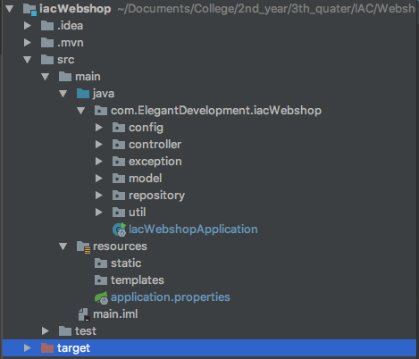

# Webshop

## Frameworks used
- Spring Boot (for easy implementation of API related stuff)
- Hibernate (**O**bject-**R**elational-**M**apping stuff)
- JPA (I don't actually know what it does, but it works.. :---) )

## A few side notes
Because we use an ORM framework (hibernate), the database is not designed like your used to. You're probably used to designing and defining a database structure by firing DDL commands to the SQL instance (e.g. `CREATE DATABASE` & `CREATE TABLE`). This is **not** the case in this project.

Database creation and management is handled by Hibernate. All we have to do is tell Hibernate what our entities should look like and what the relationships are like (one-to-one, one-to-many, etc.) We do this in the **domain** classes of our  application. More about this further down in this document.

## Global application structure
The directory structure of our project looks like this:

As you can see we have a few packages, here is what they do:
- **Model** package
  - this is where the domain classes live and thus where we define the database structure.
- **Repository** package
  - This is where the repository/DAO classes live.
  - As you'll see further down in this document, very little is needed to get this up and running.
- **Controller** package
  - This is where our REST (and SOAP in the near future) endpoints live. Incoming calls are intercepted here and almost all business logic is also done in this package.
- **Exception** package
  - Here we have a few custom exception classes, since we're not allowed to throw standard framework exceptions.
- **Config** package
  - Don't worry about this, maybe I need to add some spring config here later, when we are going to deploy.
- **Util** package
  - Here we have one class (for now) containing some logic for encoding and decoding JWT tokens (again, don't worry about it).
